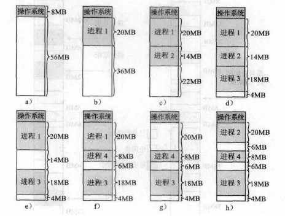
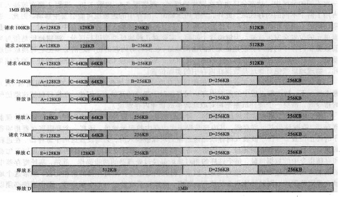

**内存管理中的地址**

* **逻辑地址**：指与当前数据在内存中的物理分配地址无关的访问地址，执行对内存访问前必须转换成物理地址
* **相对地址**：逻辑地址的一个特例，是相对于某些已知点（通常是程序开始处）的存储单元
* **物理地址(绝对地址)**：数据在内存中的实际位置
* **虚拟地址**：虚拟内存中的逻辑地址
 
**内存管理单元(MMU)**：CPU中的一个模块，将虚拟地址转换成实际物理地址

## 1.内存管理中的数据块

* **页框**：内存中一个固定长度的块
* **页**：二级存储(如磁盘)中一个固定长度的数据块
* **段**：二级存储中一个变长的数据块

## 2.内存分区

系统生成阶段，**内存被划分成许多静态(大小，容量固定不变)分区**，两种固定分区：

* **分区大小相等**
* **分区大小不等**

**放置策略**：

* **对于分区大小相等的固定分区**
    * 只要存在可用分区，就可以分配给进程
* **对于分区大小不等的固定分区**
    * **每个进程分配到能容纳它的最小分区**：每个分区维护一个队列（较多小进程时，大分区会空闲）
    * **每个进程分配到能容纳它的最小可用分区**：只需一个队列

>存在内部碎片；活动进程数固定

### 2.2 动态分区

并不进行预先分区，**在每次需要为进程分配时动态划分**

外部碎片（随着时间推移，内存中产生了越来越多”空洞“）：

可以使用压缩解决外部碎片，但是非常耗时

**放置算法**：由于压缩十分耗时，因而需要巧妙地把进程分配到内存中，塞住内存中的”洞“

* **最佳适配**：选择与要求大小最接近的块（通常性能最差，尽管每次浪费的空间最小，但结果却使得内存中很快产生许多碎片）
* **首次适配**：选择大小足够的第一个块（不仅最简单，通常也是最好、最快的；容易在首部产生碎片）
* **下次适配**：从上次放置的位置起，第一个大小足够的块（比首次适配差，常常会在尾部产生碎片）

>维护复杂，且会产生外部碎片

### 2.3 伙伴系统

内存最小块和最大块的尺寸是M和L。在为一个进程分配空间时，如果需要的内存大于L/2，则分配L的内存，否则，将大小为L的块分成两个L/2的块，继续上述步骤；如果两个相邻的块（伙伴）都未分配出去（如前面的进程释放后），则将其合并

下图为一个伙伴系统的例子：

>伙伴系统是一种折中方案，克服了固定分区和动态分区方案的缺陷。但在当前操作系统中，基于分页和分段机制的虚拟内存更好。伙伴系统在并行系统中有很多应用

### 2.4 分区中的地址转换

逻辑地址->物理地址的转换如下

* **基址寄存器**：被载入程序在内存中的起始地址
* **界限寄存器**：程序的终止位置

这种转换方式适用于程序运行时，被加载到内存中连续区域的情况。对于分页和分段，由于一个程序可以加载到内存的不同区域，所以需要使用另外的机制进行转换

## 3.分页

内存被划分为大小固定的块，且块相对比较小，每个进程也被分成同样大小的小块，那么进程中称为页的块可以指定到内存中称为页框的可用块。**和固定分区的不同在于：一个程序可以占据多个分区，这些分区不要求连续**

使用分页技术在内存中每个进程浪费的空间，仅仅是最后一页的一小部分（内部碎片）

### 3.1 分页中的地址转换

由于进程的页可能不连续，因此仅使用一个简单的基址寄存器是不够的，操作系统需要为每个进程维护一个**页表**。页表项是进程每一页与内存页框的映射

## 4.分段

段有一个最大长度限制，但不要求所有程序的所有段长度都相等。分段**类似于动态分区，区别在于：一个程序可以占据多个不连续的分区**

分段同样会产生外部碎片，但是进程被划分成多个小块，因此外部碎片也会很小

### 4.1 分段中的地址转换

由于进程的段可能不连续，因此也不能仅靠一个简单的基址寄存器，地址转换通过**段表**实现。由于段的大小不同，因此段表项中还包括段的大小

如果偏移大于段的长度，则这个地址无效

## 5.内存安全

### 5.1 缓冲区溢出

**缓冲区溢出是指输入到一个缓冲区或者数据保存区域的数据量超过了其容量，从而导致覆盖了其它区域数据的状况**。攻击者造成并利用这种状况使系统崩溃或者通过插入特制的代码来控制系统

>缓冲区溢出攻击是最普遍和最具危害性的计算机安全攻击类型之一

### 5.2 预防缓冲区溢出

广义上分为两类：

* 编译时防御系统，目的是强化系统以抵御潜伏于新程序中的恶意攻击
* 运行时预防系统，目的是检测并终止现有程序中的恶意攻击

尽管合适的防御系统已经出现几十年了，但是大量现有的脆弱的软件和系统阻碍了它们的部署。因此运行时防御有趣的地方是它能够部署在操作系统中，可以更新，并能为现有的易受攻击的程序提供保护
