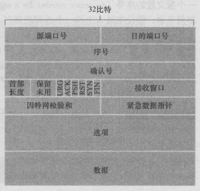
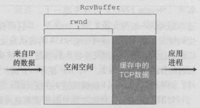
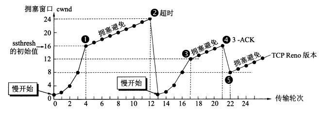

## 1.端口号与套接字

### 1.1 端口号

**通常在一台主机上能够运行许多网络应用程序。IP地址可以标识一台主机，端口号则是用来标识这台主机上的特定进程**

**端口号是一个16bit的数字，大小在0\~65535之间，0\~1023范围的端口号称为周知端口号，保留给周知的应用层协议**

|应用层协议|端口号|运输层协议|
|:--:|:--:|:--:|
|DNS|53|UDP|
|FTP|21(控制连接)，20(数据连接)|TCP|
|TELNET|23|TCP|
|DHCP|67(服务器)，68(客户端)|UDP|
|HTTP|80|TCP|
|HTTPS|443|TCP|
|SMTP|25|TCP|
|POP3|110|TCP|
|IMAP|143|TCP|

### 1.2 套接字

网络应用由成对进程组成，进程通过一个称为套接字的软件接口在网络上发生和接收报文    

#### TCP套接字：(源IP,源端口,目的IP,目的端口)

#### UDP套接字：(目的IP,目的端口)

## 3.UDP

出于下列原因可能使用UDP：

1. 应用层能更好地控制要发送的数据和发送时间（TCP拥塞时会遏制发送方发送）
2. 无需建立连接
3. 无连接状态（TCP需要维护连接状态，包括接收和发送缓存、拥塞控制参数、序号与确认号的参数）
4. 分组首部开销小（**每个TCP报文段有20字节的首部开销，而UDP仅有8字节的开销**）

可以在应用程序自身中构建可靠性机制来实现UDP应用的可靠数据传输

UDP能提供运输层最低限度的两个服务：**差错检测、数据交付**

### 3.1 UDP报文段结构

UDP首部只有4个字段，每个字段2个字节，一共8个字节大小的首部

## 4 可靠数据传输原理

* **rdt**：可靠数据传输
* **udt**：不可靠数据传输

#### 1）回退N步(GBN) 也被称为滑动窗口协议  

 * **发送方**
     - 超时重传所有已发送但未确认的分组
 * **接收方**
     - 每接收到一个有序分组交付到上层，丢弃无序分组
     - 累积确认收到的有序分组

**丢弃无序分组的优点在于接收方缓存简单，需要维护的唯一信息就是下一个按序接收的分组的序号；缺点是对于丢弃的分组，随后重传也许会丢失或出错，因此甚至需要更多的重传**  

下图为窗口长度为4个分组的GBN运行情况：

  

#### 2）选择重传(SR)
一个单个分组的差错就可能引起GBN重传大量分组，许多分组根本没有必要重传。  

* **发送方**
    - 如果收到的ACK对应一个窗口内的分组，则标记为已接收，序号等于send_base则移动窗口至具有最小序号的未确认分组处
    - 如果窗口移动了，并且有序号落在窗口内的未发送分组，则发送这些分组
    - 如果发生超时，只能发送1个分组
* **接收方**
    - 确认(ACK)一个正确接收到的分组（收到滑动窗口前的分组也要再次确认，因为这种情况通常意味着这个分组的前一次确认未被发送方收到）
    - 失序分组会被缓存直到所有丢失分组都被收到，此时将一批分组按序交付给上层  

## 5.TCP  

TCP是面向连接的，提供全双工的服务：数据流可以双向传输。也是点对点的，即在单个发送方与单个接收方之间的连接  

* **序号**：TCP的序号是数据流中的字节数，不是分组的序号。表示该报文段数据字段首字节的序号
* **确认号**：TCP使用累积确认，确认号是第一个未收到的字节序号，表示希望接收到的下一个字节
* **首部长度**：**通常选项字段为空，所以一般TCP首部的长度是20字节**
* (可选与变长的)**选项字段**：用于发送方与接收方协商MSS(最大报文段长)，或在高速网络环境下用作窗口调节因子
* **标志字段**
    - **ACK**：指示确认字段中的值是有效的
    - **RST,SYN,FIN**：连接建立与拆除
    - **PSH**：指示接收方应立即将数据交给上层
    - **URG**：报文段中存在着(被发送方的上层实体置位)“紧急”的数据
* **接收窗口**：用于流量控制（表示接收方还有多少可用的缓存空间）

TCP RFC并没有规定失序到达的分组应该如何处理，而是交给程序员。可以选择丢弃或保留

如果发生超时，TCP**只重传第一个已发送而未确认的分组**，超时时间间隔会设置为原来的2倍  

### 5.2 流量控制  

如果应用程序读取数据相当慢，而发送方发送数据太多、 发送方维护一个“接收窗口”变量，这个变量表示接收方当前可用的缓存空间 

* LastByteRead:接收方应用程序从接收缓存中读取的最后一个字节
* LastByteRcvd:接收方接收到的最后一个字节 

要防止缓存溢出，则应该满足如下条件：

LastByteRecv - LastByteRead <= RcvBuffer

接收方可通过下列公式计算RcvWindow:

RcvWindow = RcvBuffer - [LastByteRecv - LastByteRead]

 

### 5.3 连接管理 

#### 3次握手 

1. **客户端向服务器发送SYN报文段**（不包含应用层数据，首部的一个标志位(即SYN比特)被置位，客户端随机化选择(避免攻击)一个起始序号x）
2. 服务器为该TCP连接分配TCP缓存和变量，**返回一个SYNACK报文段**（也不包含应用层数据，SYN比特被置为1，ACK为x+1，服务器选择自己的初始序列y）
3. 客户机为该连接分配缓存和变量，**返回一个对SYNACK报文段进行确认的报文段**（因为连接已经建立了，所以SYN比特被置为0） 
   
**如果客户端不发送ACK来完成第三次握手，最终(通常是一分钟后)服务器将终止该半开连接并回收已分配的资源（在第三次握手前分配缓存和变量，可能会受到SYN洪泛攻击）**

**如果第二次握手丢包怎么办？第三次呢？** 

* **第二个包，即B发给A的SYN +ACK 中途被丢，没有到达A**：B会周期性超时重传，直到收到A的确认 
* **第三个包，即A发给B的ACK 中途被丢，没有到达B**：A发完ACK，单方面认为TCP为 Established状态，而B显然认为TCP为Active状态
    - **假定此时双方都没有数据发送**：B会周期性超时重传，直到收到A的确认，收到之后B的TCP 连接也为Established状态，双向可以发包
    - **假定此时A有数据发送**：B收到A的 Data + ACK，自然会切换为established 状态，并接受A的Data
    - **假定B有数据发送**：数据发送不了，会一直周期性超时重传SYN + ACK，直到收到A的确认才可以发送数据 

**SYN cookies预防SYN洪泛攻击**： 

* 当服务器接收到一个SYN报文段时，它并不知道该报文段是来自一个合法的用户，还是一个SYN洪泛攻击的一部分。因此服务器不会为该报文段生成一个半开TCP连接。相反，服务器生成一个**初始TCP序列号y**，该序列号是SYN报文段的**源和目的IP地址、端口号**以及仅被该服务器所知的**秘密数**的一个散列函数，这种精心制作的初始序列号被称作“cookie”。服务器发送具有这种特殊序列号的SYNACK分组，服务器并不记忆该cookie或任何对应于SYN的其他状态信息
* 如果客户机是合法的，它将返回一个ACK报文段。服务器一旦收到该ACK，需要验证与前面发送的某些SYN对应的ACK。对于一个合法的ACK，确认字段中的值等于SYNACK序号字段y的值加1。服务器将使用在ACK报文段中的相同字段和秘密数运行相同的函数。如果该函数的结果加1与确认号相同，服务器就认为该ACK对应于前面发送的SYN报文段，生成一个具有套接字的全开的连接
* 如果客户机没有返回一个ACK报文段，则初始化的SYN也没有对该服务器产生危害，因为服务器没有为它分配任何资源

#### 4次挥手

TCP连接的两个进程中任意一个都能终止该连接，连接关闭需要4步。假设客户端发起一个关闭请求： 

1. **客户端发送一个FIN报文**（首部中的FIN比特被置位）
2. **服务器返回一个对FIN报文的确认报文**
3. **服务器发送一个FIN报文**（首部中的FIN比特被置位）
4. **客户端返回一个对FIN报文的确认报文**

**MSL(最长分节生命期)是任何IP数据报能够在因特网中存活的最长时间**（IP数据报中的TTL首部为8位，具有最大TTL，即255的分组，在网络中存在的时间不能超过MSL）。任何TCP实现都必须为MSL选择一个值。RFC 1122的建议值是2分钟，不过源自Berkeley的实现传统上改用30秒。意味着TIME_WAIT状态的持续时间再1分钟到4分钟之间

>四次挥手是因为TCP是全双工的，前2次挥手用于关闭一个方向的数据通道，后两次挥手用于关闭另外一个方向的数据通道

[TIME-WAIT状态的详细说明](http://elf8848.iteye.com/blog/1739571)，主要有2个存在的理由：

* 可靠地实现TCP全双工连接的终止
* 等待迷途分组在网络中消逝

### 5.4 拥塞控制 

拥塞控制分类：

* 端到端拥塞控制：网络层没有为运输层拥塞控制提供显示支持（TCP的拥塞控制）
* 网络辅助的拥塞控制：网络层组件向发送方提供关于网络中拥塞状态的显式反馈信息（ATM ABR）
    - 直接反馈：路由器通过阻塞分组直接通知发送方拥塞
    - 路由器标记或更新从发送方流向接收方的分组中的某个字段来指示拥塞，接收方收到后通知发送方

#### TCP拥塞控制 

由于IP层不向端系统提供显示的网络拥塞反馈，所以TCP必须使用端到端拥塞控制，而不是网络辅助拥塞控制

**TCP连接的两方都记录一个额外的变量：拥塞窗口(CongWin)**，它对一个TCP发送方能向网络中发送流量的速率进行了限制。特别是，在一个发送方中未被确认的数据量不会超过CongWin与RcvWindow中的最小值:

LastByteSent - LastByteAcked <= min{CongWin,RcvWindow} 

**两个拥塞指示**：

* **3次冗余ACK**(第一次冗余是第二次收到相同ACK时，所以一共4次)
* **超时**

**TCP拥塞控制算法包括三个主要部分**

1. **加性增、乘性减**
    * 加性增：缓慢增加CongWin，每个RTT增加1个MSS，线性增长（拥塞避免）
    * 乘性减：发生丢包时，设置CongWin = CongWin/2（不低于1个MSS），从而控制发送速度 
2. **慢启动**：TCP连接开始时，CongWin的初始值为1个MSS，指数型增长
3. **对拥塞指示作出反应**
    * 3次冗余ACK：CongWin = CongWin/2，然后线性增加（拥塞避免）
    * 超时：CongWin被设置为1个MSS，然后指数增长，直到CongWin达到超时前的一半为止
  
**Threshold(阈值)**：用于确定慢启动将结束并且拥塞避免将开始的窗口长度，初始化为一个很大的值，每当发送一个丢包时，会被设置为丢包时CongWin的一半

