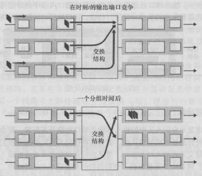
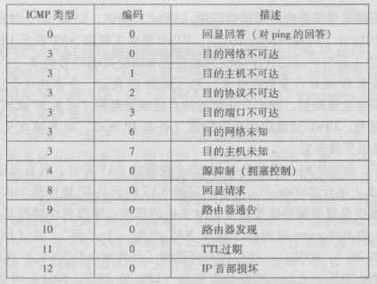

## 1.网络层功能和服务 

网络层的3个重要功能

1. **转发**：当一个分组到达某路由器的一条输入链路时，路由器将分组移动到适当输出链路的过程
2. **选路**：当分组从发送方传至接收方时，网络层决定这些分组所采用的路由或路径的过程
3. **连接建立**：ATM等非因特网的网络层体系结构要求从源到目的地沿着所选的路径建立连接

**虚电路和数据报网络**

* **虚电路(VC)网络**：面向连接的，数据按需到达，分组不会丢失，路由器为进行中的连接维持连接状态信息
* **数据报网络**：无连接的，但在转发表中维持了转发状态信息。**因特网是数据报网络**  

## 2.转发

使用**最长前缀匹配**来匹配路由表中的表项，决定转发出口 

## 2.1 路由器

路由器由4部分组成：

* **输入端口**
* **交换结构**
* **输出端口**
* **选路处理器**：维护有选路信息与转发表，并执行路由器中的网络管理功能

  

#### 1）输入端口

* **查找/转发模块**：对于路由器的转发功能是至关重要的。许多路由器中，都是在这确定一个到达的分组经交换结构转发到哪个输出端口。虽然转发表是由选路处理器计算的，但通常一份转发表的影子拷贝会被存放在每个输入端口，而且会被更新。因此，就可以在每个输入端口本地做出转发决策，而无需调用中央选路处理器，从而可以避免在路由器中的某个单点产生转发处理的瓶颈  

#### 2）交换结构

一个分组可能会在进入交换结构时暂时阻塞，这是由于来自其它输入端口的分组正在使用该交换结构

* **经内存交换**：分组到达输入端口时，端口会通过中断向选路处理器发出信号，于是分组被拷贝到处理器内存中。选路处理器则从分组首部中取出目的地址，在转发表中找出适当的输出端口，并将分组拷贝到输出端口的缓存中
* **经一根总线交换**：经一根共享总线将分组直接传送到输出端口，不需要选路处理器的干预。因为总线是共享的，故一次只能有一个分组通过总线传送
* **经一个互连网络交换**：到达某个输入端口的分组沿着连到输入端口的水平总线穿行，直至该水平总线与连到所希望的输出端口的垂直总线的交叉点 

#### 3）输出端口

输出端口处理取出存放在输出端口内存中的分组并将其传输到输出链路上。当交换结构将分组交付给输出端口的速率超过输出链路速率时，就需要排队与缓存管理功能

 

### 4）排队

输入端口和输出端口都能形成分组队列，随着队列的增长，路由器的缓存空间将会最终耗尽，出现**丢包**

**输出端口排队**：当所有输入端口的分组发往同一个输出端口并且交换结构速率足够大而输出端口的分组传输速率不高时，分组会在该输出端口排队。排队的后果是，输出端口上的一个分组调度程序必须在这些排队的分组中选一个来传送，分组调度程序在提供服务质量保证方面起着关键作用

**输入端口排队**：如果交换结构速率不高，不同输入端口的队首分组需要发往同一个输出端口，此时交换结构需要选择其中一个输入端口的分组进行发送。因此，其它输入端口中的分组会阻塞产生排队。在队首分组之后的分组，也会因为队首分组阻塞而被阻塞，即使它们需要转发到的输出端口此时处于空闲。这种现象叫做作**线路前部阻塞(HOL)**

 

## 3.选路

* **第一跳路由器 = 默认路由器 = 源路由器**
* **目的路由器：目的主机的默认路由器**

源主机到目的主机选路的问题可归结为从源路由器到目的路由器的选路问题

### 3.1 全局选路算法(LS算法)

全局选路算法用完整的、全局性的网络信息来计算从源到目的地之间的最低费用路径。由于具有全局状态信息，所以这种算法又常被称为**链路状态算法**

* **Dijkstra算法**（下图为一个处理过程）

### 3.2 分布式选路算法(距离向量算法)  
以迭代的、分布式的方式计算出最低费用路径。和全局选路算法的区别在于，**没有节点拥有关于所有网络链路费用的完整信息，每个节点仅有与其直接相连链路的费用信息**

* **距离向量算法(DV)**
    - 分布式：每个节点从一个或多个直接相连的邻居接收某些信息，执行计算，然后将计算结果发回邻居
    - 迭代：上述过程持续到邻居之间没有更多的信息要交换为止
    - 异步：不要求所有节点相互之间步伐一致 

### 3.3 因特网中的选路 

着路由器数目变大，选路信息的计算、存储及通信的开销逐渐高得惊人，数亿台主机中存储选路信息需要巨大容量的内存。在公共因特网上所有路由器上广播LS更新的开销将导致没有剩余带宽供发送数据分组使用。距离向量算法在如此大的路由器中的迭代将肯定永远不会收敛。可以将路由器组织成自治系统(AS)来解决

**自治系统(AS)**：一组处于相同的管理与技术控制下的路由器集合（ISP和AS之间是什么关系？通常一个ISP中的路由器和互连它们的链路构成了单个AS，但许多ISP将它们的网络划分为多个AS）

因特网中的选路协议：

* **AS之间**
    - **边界网关协议(BGP/BGP4)**
        - 路由器对使用179端口的半永久TCP连接交换选路信息
        - 每条TCP连接的两台路由器被称为BGP对等方
        - 发送BGP报文的“TCP连接”称为BGP会话（跨越两个AS之间的BGP会话称为eBGP，同一AS中两个路由器间的BGP会话称为内部BGP会话）
        - BGP中，目的地是CIDR化的前缀，表示一个子网或子网集合（假设有多个子网与一个AS相连，AS会聚合这些前缀，来向相邻的AS通告聚合后的单一前缀，如果到达相同前缀有多个路由，BGP会使用一些规则消除直到留下一条路由）
* **AS内部**
    - **开放最短路径优先(OSPF)**
        - 直接承载在IP分组中，必须自己实现可靠报文传输、链路状态广播等功能
        - 使用**LS选路算法**，链路费用是由网络管理员配置的
        - 通常用于较顶层的ISP中，而RIP通常用于较低层的ISP中
        - 至少每隔30分钟广播一次链路状态(即使状态未发生改变)
    - **选路信息协议(RIP)**
        - 运行于UDP之上的应用层协议
        - 使用**DV选路算法**，使用跳数作为费用测度，“跳”是从源路由器到目的子网的子网数，一条路径的最大费用被限制为15，从而限制了使用RIP的AS规模。
        - 大约每30秒通过RIP响应报文(也称为RIP通告)交换距离向量信息

## 4.IP(网际协议)

### 4.1 因特网三大组件

1. **IP协议**
2. **选路组件**
3. **报告数据报中的差错和对某些网络层信息请求进行响应的设施** 

### 4.2 数据报格式

下图为一个IPv4数据报的格式：

* **版本号**：IP协议的版本，路由器根据版本号确定如何解释剩余部分
* **首部长度**：一个IPV4数据报可包含一些可选项，所以需要用4比特确定数据部分实际从哪开始，**大多数IP数据报不包含可选项，有20字节的首部**
* **服务类型**：可以使不同类型(实时与非实时等)的IP数据报区分开来
* **数据报长度**：IP数据报的总长（**16bit，首部+数据，所以IPv4数据报的最大大小是65535字节**）
* **寿命(TTL)**：8位，用以确保数据报不会永远在网络中循环，每经过一台路由器减1，减为0时丢弃
* **上层协议**：指明了数据部分应该交给哪个运输层协议（UDP(6)、TCP(17)）
* **首部校验和**：首部中每2个字节作为一个数，和的反码存入校验和字段中。路由器一般会丢弃检测出的错误数据报。每台路由器上都必须重新计算并更新校验和，因为TTL及选项字段可能会改变
* **选项**：在IPv6中已不再使用

除此之外，首部中的以下3个字段用于IP数据报分片的标识

* **标识**：识别分片的序号
* **标志**：最后一个分片的标志为0，其余分片的标志为1（设置DF位表示不允许分片，可用于路径MTU发现）
* **比特片偏移**：该分片起始数据在原数据报中的偏移量/8

> IPv4要求的最小链路MTU是68字节，这允许最大IPv4首部(20字节固定长度+最多40字节选项部分)拼接最小的片段（IPv4首部中片段偏移字段以8个字节为单位） 

## 4.3 IP数据报分片

一个链路层帧能承载的最大数据量叫做**最大传输单元(MTU)（以太网可承载不超过1500字节的数据）**，因为每个IP数据报封装在链路层帧中，再从一台路由器运输到下一台路由器，故链路层协议MTU严格地限制着IP数据报的长度。发送方与目的地路径上的**每段链路可能使用不同的链路层协议**，**每种协议**可能具有不同的MTU，如果转发表查找决定的出链路的MTU比该IP数据报的长度小，则需要对IP数据报进行分片。片在到达目的地运输层以前需要被组装，如果一个或多个片没有到达目的地，则该不完整的数据报被丢弃

### 4.4 IPv4编址

主机与物理链路之间的边界叫做接口，一个IP地址在技术上是与一个接口相关联的，而不是与包括该接口的主机或路由器相关联的

IP地址编址格式：**点分十进制**，一个接口的IP地址的组成部分需要由其连接的子网来决定。互连主机的接口与路由器一个接口的网络形成一个**子网**：

IP编址为子网分配一个地址：223.1.1.0/24，其中/24记法称为**子网掩码**。其它要连到223.1.1.0/24网络的主机都要求其地址形式为223.1.1.xxx

上图对应了下图中3个子网：

除此之外，子网还包括互连路由器接口的网段

#### 1）分类编制

在无类别域间选路之前，IP地址的分配策略采用分类编制，网络分为下面3类

* A类网络：网络部分被限制长度为8比特
* B类网络：网络部分被限制长度为16比特
* C类网络：网络部分被限制长度为24比特

**分类编制的问题在于：对于一个组织，分配一个B类网络可能太大，分配一个C类网络可能太小，这样分配B类网络就会造成地址空间的迅速消耗，以及大量的地址浪费。这个问题类似于操作系统内存管理中固定分区的问题**

#### 2）无类别域间选路(CIDR)

32比特的IP地址被划分为2部分，a.b.c.d/x，前x比特构成了IP地址的网络部分，被称为该地址的网络前缀

组织外部的路由器仅考虑前缀比特，大大减少了路由器中的转发表的长度。剩余32-x比特用于区分组织内部设备，当组织内部的路由器转发分组时，才会考虑这些比特

>IP地址由因特网名字与号码分配机构(ICANN)管理，非盈利的ICANN不仅分配IP地址，还管理DNS根服务器、解决分配域名与域名纠纷，ICANN向地区性因特网注册机构分配地址，这些机构一起形成了ICANN地址支持组织，处理本地域内的地址分配/管理 

### 4.5 DHCP(动态主机配置协议)

一个组织一旦获得一块地址，就可以为该组织内的主机和路由器接口分配独立的IP地址

DHCP可以提供以下服务：

* 为主机分配IP地址
* 获取子网掩码
* 获取第一跳路由器地址（常称为默认网关）
* 提供本地DNS服务器的地址（记录在/etc/resolv.conf文件中）

由于DHCP具有能将主机连接进一个网络的自动化网络相关方面的能力，故它又常被称为**即插即用协议**

每个子网拥有一台DHCP服务器，如果某个子网没有DHCP服务器，则需要一个知道用于该网络的一台DHCP服务器地址的DHCP中继代理（通常是一台路由器）

**DHCP协议的4个步骤：**

1. **DHCP服务器发现**：新到的客户端在68号端口使用UDP广播(255.255.255.255)**DHCP发现报文**，源地址为0.0.0.0
2. **DHCP服务器提供**：子网中收到DHCP请求报文的DHCP服务器使用**DHCP提供报文**作出响应，提供IP地址、网络掩码、IP地址租用期(通常设置为几个小时或几天)
3. **DHCP请求**：客户端从多个服务器的响应中选择一个，并用一个**DHCP请求报文**对选中的服务器进行响应，回显配置参数（这一步目的地址使用广播地址是因为在DHCP服务器提供时，服务器为客户预分配了IP地址，因此，客户有责任通知不采用的服务器，好让它们释放预分配的地址）
4. **DHCP ACK**：服务器用**DHCP ACK报文**对DHCP请求报文进行响应，证实所要求的参数

>DHCP有不足之处：每当一个节点连到一个新子网时，都要从DHCP得到一个新的IP地址，这样当一个移动节点在子网直接移动时，就不能维持与远程应用之间的连接。移动IP是一种对IP基础设施的扩展，允许移动节点在子网之间移动时能使用其单一永久的地址

## 4.6 NAT(网络地址转换)

NAT适用这样一种场景：由于每个IP使能的设备都需要一个IP地址，如果一个子网已经获得了一块IP地址，当连入设备增加时，IP地址可能不足

NAT主要通过**NAT使能路由器**来解决上述问题。同时，地址空间10.0.0.0/8是在RFC 1918中保留的3部分IP地址空间之一，可以用于专用网络或具有专用地址的地域（具有专用地址的地域是指其地址仅对该网络中的设备有意义的网络），关键问题是：专用地址对于外部网络无效，使用专用地址的设备如何与外部网络通信？为了解决这个问题，NAT使能路由器中保存有一个NAT转换表：

NAT使能路由器对外界的行为就像一个具有单一IP地址的单一设备，通过端口号来标识一个使用专用地址的设备

* 当专用设备与外界通信时，NAT使能路由器为其生成一个新的源端口号，并使用连入广域网一侧接口的IP地址作为源地址发送数据报，同时会将这个映射关系记录在NAT转换表中
* 当有数据报到达时，NAT使能路由器通过查找NAT转换表中的映射关系，改写目的IP和端口号，向专用网络转发数据报

**私有IP网段：**

* **10.0.0.0 ~ 10.255.255.255**
* **172.16.0.0 ~ 172.31.255.255**
* **192.168.0.0 ~ 192.168.255.255**

>NAT有很多争议：1）端口号是用于编址进程的方法，不是用于编址主机的；2）路由器应该处理最多达第三层的分组；3）NAT违反了所谓的“端到端原则”；4）解决IP地址短缺的方法应该是IPv6，而不是像NAT这样一种权宜之计；但是不管喜欢与否，NAT已成为因特网一个重要的组件

## 4.7 ICMP(互联网控制报文协议)

ICMP用于主机和路由器彼此交互网络层信息。最典型的用途是差错报告，但其用途不仅限于此(如源抑制，用于拥塞控制)

ICMP通常被认为是IP的一部分，但从体系结构上讲，它是位于IP之上，因为ICMP报文承载在IP分组中，作为IP有效载荷

ICMP的类型和编码：

>Traceroute：允许用户跟踪从一台主机到世界上任意一台其他主机之间的路由，使用ICMP报文实现。发送一系列不可达UDP端口号的UDP报文段，每个报文段封装后的数据报TTL字段逐1递增，TTL为n的数据报到达第n跳路由器时，由于TTL过期，路由器会生成ICMP报文响应，由此可以获得第n跳路由器的IP和名字，当一个数据报最终到达目的主机时，由于UDP端口不可达，目的主机生成一个ICMP报文，指示此错误信息，从而Traceroute知道不需要再发送探测分组了，因此获得了到达目的主机的所有路由数量、标识以及RTT

