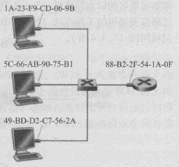
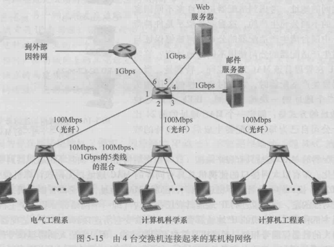

## 1.链路层提供的服务

链路层可能提供的服务包括：

* **成帧**：将网络数据报封装成帧
* **链路接入**：媒体访问控制(MAC)协议规定了帧在链路上传输的规则
* **可靠交付**：可靠交付服务通常用于易产生高差错率的链路，对于低比特差错的链路，可靠交付可能被认为是一种不必要的开销，因此不提供此服务
* **流量控制**：没有流量控制，可能会造成缓存区溢出
* **差错检测**
* **差错纠正**
* **半双工和全双工**：全双工时，链路两端的节点可以同时传输分组

### 1.1 差错检测和纠错技术

在发送节点，为了避免比特差错，使用**差错检测和纠错比特(EDC)**来增强数据D

差错检测和纠正技术有时使接收方检测到已经出现的比特差错，但并非总是这样。即使采用差错检测比特，也还是可能有未检出比特差错的情况  
因此，主要是选择一个差错检测方案，使得这种事件发生的概率很小。可以使用下列3种技术进行差错检测：

1. **奇偶校验**：只需包含1个附加比特。
    * 对于**偶校验**，选择一个值使得所有比特中1出现偶数次
    * 对于**奇校验**，选择一个值使得所有比特中1出现基数次
    接收方通过检测1出现的次数判断是否出现差错。如果出现偶数个比特差错，则检验不出。可以使用二维化的方案（详见教材）进行优化
2. **校验和**：通常更多的应用于运输层。将数据分为多个k比特的序列，相加(可能回滚)后取反，作为校验和。接收方对所有k比特（包括校验和）的序列相加，结果的任意比特如果出现0，则检测为出现比特差错
3. **循环冗余检测(CRC)**：发送方和接收方协商一个r+1比特的生成多项式(G)，要起其最高比特位为1。发送方通过在d比特的数据后附加r比特，使得整个(d+r)比特的值能够被G整除。接收方用G去除(d+r)比特，如果余数非0，则出现差错

## 2.媒体访问控制(MAC)协议

### 2.1 点对点协议(PPP)

点对点协议(PPP)用于**点对点链路**，点对点链路由链路一端的单个发送方和链路另一端的单个接收方组成。通常住宅主机拨号链路就是用的PPP，所以它是目前部署最广泛的链路层协议之一

### 2.2 多路访问协议

多路访问协议用于**广播链路**，广播链路能够让多个发送和接收节点都连接到相同的、单一的、共享的广播信道上。多路访问协议用于协调多个发送和接收节点对一个共享广播信道的访问

1. **信道划分协议**
    * **TDM(时分多路复用)**：对于N个节点的信道，传输速率为R bps，TDM将时间划分为时间帧，并进一步划分每个时间帧为N个时隙，每个节点在特定的时隙内传输（消除了碰撞，非常公平；但节点被限制与R/N bps的平均速率，即使只有一个节点有数据要发送）
    * **FDM(频分多路复用)**：在R bps的信道中创建了N个较小的R/N bps信道，每个节点使用一个较小的信道传输（消除了碰撞，公平；但节点被限制与R/N bps的平均速率，即使只有一个节点有数据要发送）
    * **CDMA(码分多址)**：每个节点分配一种不同的编码，每个节点使用其唯一的编码来对发送的数据进行编码（如果精心选择编码，不同节点能同时传输）
2. **随机接入协议**
    * **纯ALOHA**：帧到达节点时，立刻传输。如果发生碰撞，节点将立即(在完全传输碰撞帧后)以概率p重传。否则，等待一个帧传输时间，再以概率p重传...（信道有效传输速率实际不是R bps，而是时隙ALOHA的一半，详见教材）
    * **时隙ALOHA**：时间被划分为时隙，每个节点的时间同步，帧的传输只在时隙的开始时进行。如果发生碰撞，在下一个时隙开始时以概率p重传，否则等待一个时隙再以概率p重传...（信道有效传输速率实际不是R bps，而是0.37R bps，详见教材）
    * **CSMA(载波侦听多路访问)**：发送前先侦听信道，如果没有其它节点在使用信道，则传输数据。CSMA没有碰撞检测，即使发生碰撞，也将传输完碰撞帧（由于节点间数据传输存在时延，很可能一个传输正在信道中但是由于还未到达所以检测到信道空闲，此时传输最终会发生碰撞）
    * **CSMA/CD(具有碰撞检测的载波侦听多路访问)**：先侦听信道，如果没有其它节点在使用信道，则传输数据。但是有碰撞检测，如果发生碰撞，会停止传输剩下的数据，等待一个随机时间(通常比传输一帧短)后，再进行尝试
3. **轮流协议**
    * **轮询协议**：指定节点之一为主节点。主节点以循环的方式轮询每个节点。告诉每个节点能够传输的最大帧数，然后让节点传输帧，主节点通过观察信道上是否缺乏信号来决定一个节点合适完成了帧的发送（消除了困扰随机接入协议的碰撞和空时隙，效率很高；但引入了轮询延时，同时主节点发生故障将使信道不可用）
    * **令牌传递协议**：节点间通过令牌传递信道使用权，如果没有数据发送，立即传递令牌给下一节点（一个节点的故障可能会使整个信道崩溃。或者如果一个节点忘记释放令牌，必须调用某些恢复步骤使令牌返回到循环中来）

## 3.链路层编制

### 3.1 MAC地址

长度为**6字节，共48比特**，通常用**十六进制表示法**，地址的每个字节被表示为一对十六进制数

* **每个适配器具有一个唯一的MAC地址，不随位置发生变化**（就像人的身份证，而IP则像人的邮政地址）
* **一台路由器的每个接口都有一个ARP模块和一个适配器**

**MAC地址分配**：当一个公司要生产适配器时，它支付象征性的费用购买一块MAC地址空间，IEEE分配这块地址时，固定前24比特，让公司自己为每个适配器生成后24比特的唯一组合

### 3.2 ARP(地址解析协议)

**提供将IP地址转换为链路层地址的机制**（ARP只为同一子网上的节点解析IP地址，DNS为因特网中任何地方的主机解析主机名）：
1. 每个节点的ARP模块都在它的RAM中有一个ARP表，包含IP地址到MAC地址的映射关系，每个表项还包含TTL字段，表示表项过期时间（ARP表是自动创建的，如果某节点与子网断开连接，它的表项最终会从留在子网中的节点的表中删除。通常一个表项的过期时间是20分钟）
2. 主机向其ARP模块提供一个IP地址，ARP模块返回IP地址对应的MAC地址

**如果相应表项尚未存在ARP表中**？
1. 查询节点构造**ARP查询分组**，包含有查询节点和目的节点的IP地址，适配器在链路层帧中封装这个ARP分组，广播帧
2. 子网中的所有其他适配器接收到帧，将帧中的ARP分组向上传递给ARP模块，每个节点检查自身IP是否与ARP查询分组中的目的IP地址相同，相同的返回一个**ARP响应分组**​​​​​​
3. 查询节点接收到ARP分组，获得目的MAC地址，并更新自身的ARP表

**发送数据报到子网以外**？

假设主机1要向主机2发送数据报，应该使用什么MAC地址？如果使用49-BD-D2-C7-56-2A作为目的MAC地址，由于子网内任何一个适配器的MAC地址都不匹配，所以这个数据报将会死亡。正确的步骤如下：

1. 主机1通过ARP获取路由器接口111.111.111.110的MAC地址，将数据报封装成帧，转发
2. 路由器的接口111.111.111.110收到帧，由于MAC地址匹配，适配器获取帧中的数据报上传给网络层
3. 路由器通过查找转发表将数据报通过交换结构转发到输出接口222.222.222.220
4. 输出接口222.222.222.220通过ARP获取子网中主机2的MAC地址
5. 获得主机2的MAC地址后，将数据报传递给适配器，封装成帧，最终发送到主机2

## 4.以太网

虽然20世纪80年代和90年代早期，以太网面临着其他LAN技术包括令牌环、FDDI、ATM的挑战，但是至今，以太网仍是最流行的有线局域网技术

所有的以太网技术都向网络层提供**无连接服务**、**不可靠服务**

### 4.1 以太网帧结构

* **前同步码**：8字节。以太网帧以一个8字节的前同步码字段开始。前7个字节的值都是10101010，最后一个字节是10101011。前7个字节用于“唤醒”接收适配器，并且将其时钟与发送方的时钟同步，第8个字节的最后两个1告诉接收适配器，“重要的内容”就要来了，因此接收适配器知道接下来的6个字节是目的地址
* **类型**：网络层协议类型
* **数据**：46\~1500字节。承载了IP数据报，以太网的最大传输单元(MTU)是1500字节，IP数据报最小46字节，如果不够会填充（如果填充，在目的端填充也会上传到网络层，通过数据报首部的长度字段去除填充）
* **循环冗余检测(CRC)**：提供差错检测与纠正，具体见1.1。如果校验成果，并不会发送肯定确认。如果校验失败，也不会发生否定确认，只是丢弃该帧

**头信息有14字节，尾部校验和FCS占4字节。因此，一个标准的以太网数据帧大小是1518**

### 4.2 链路层交换机

现代以太网LAN使用了一种星型拓扑，每个节点与中心交换机相连

* 交换机的任务是接收入链路层帧并将它们转发到出链路
* 交换机自身对节点透明：某节点向另一节点寻址一个帧，顺利地将该帧发送进LAN，而不知道这个帧经过了某个交换机的接收与转发

**交换机具有如下性质**：

* **消除碰撞**：交换机缓存帧并且绝不会在网段上同时传输多于一个帧。交换机的最大聚合带宽是所有接口速率之和
* **异质的链路**：交换机将链路彼此隔离，LAN中的不同链路能够以不同的速率运行，并且能够在不同的媒体上运行

#### 1）交换机转发与过滤

* **过滤**：交换机决定一个帧是应该转发还是应该丢弃
* **转发**：决定一个帧应该被导向哪个接口

过滤和转发都借助于**交换机表**：

假设具有目的地址DD-DD-DD-DD-DD-DD的帧从交换机的x接口到达：

* 如果表中没有针对DD-DD-DD-DD-DD-DD的表项，则向除了x的其它所有接口广播帧
* 如果表中有针对DD-DD-DD-DD-DD-DD的表项
    - 1）接口等于x：(说明帧的目的地和帧处于同一子网，意味着该帧已经在包含目的地址的LAN网段广播过了)该帧执行过滤功能
    - 2）接口为y，不等于x：将帧转发到接口y的输出缓存区

#### 3）交换机与路由器对比

* **交换机**
    - **优点**
        + 即插即用
        + 相对高的分组过滤、转发速率
    - **缺点**
        + 交换网络的活跃拓扑限制为一棵生成树（为了防止广播帧的循环）
        + 对广播风暴不提供任何保护措施（如果某主机故障，没完没了传输广播帧流，交换机会转发所有这些帧，使得整个以太网崩溃）
* **路由器**
    - **优点**
        + 分组不会被限制在一棵生成树上，从而能用各种拓扑结构来构建因特网
        + 对广播风暴提供了防火墙保护
    - **缺点**
        + 不是即插即用（需要人为配置IP地址）
        + 对分组的处理时间更长（必须处理高达第3层的字段）